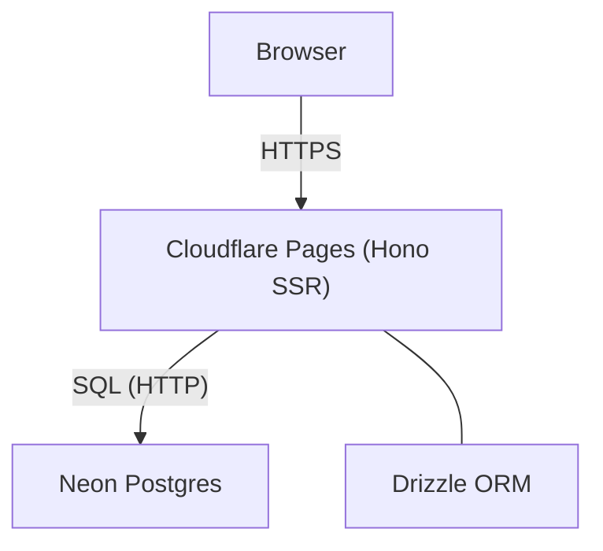

# Todo App

## 概要
Hono + Neon + Drizzle + Cloudflare Pages で構築した、最小構成のTodoアプリです。Hono JSXでUIを生成し、NeonのサーバーレスPostgreSQLへDrizzleのneon-httpドライバで接続します。

## システム構成図


## 機能一覧表
| 機能 | 説明 |
|---|---|
| Todo追加 | テキストを入力して追加 |
| Todo一覧 | 追加済みのTodoを一覧表示 |
| 完了/未完了切替 | ボタンで状態を切り替え |
| Todo削除 | 不要なTodoを削除 |

## 技術スタック表
| 技術 | 概要 | バージョン |
|---|---|---|
| Hono | エッジ向けWebフレームワーク | ^4.11.9 |
| Cloudflare Pages | ホスティング/実行環境 | - |
| Neon | サーバーレスPostgreSQL | - |
| Drizzle ORM | TypeScript ORM | latest |
| Neon serverless driver | NeonのHTTPドライバ | latest |
| Vite | 開発/ビルド | ^6.3.5 |
| Wrangler | デプロイ/開発ツール | ^4.4.0 |
| Zod | バリデーション | 4.0.0 |

## セットアップ方法
1. 依存関係をインストール
   ```bash
   bun install
   ```
2. 環境変数を用意
   ```bash
   cp .env.example .env
   ```
   `.env` の `DATABASE_URL` をNeonの接続文字列に置き換えてください。
3. スキーマをDBに反映
   ```bash
   bun run db:push
   ```

## 動かし方
### ローカル開発
```bash
bun run dev
```
http://localhost:5173 にアクセスしてください。

### ビルド
```bash
bun run build
```

### Cloudflare Pagesへデプロイ

```bash
bun run deploy
```

以下のようにあればOK!

```bash
✨ Success! Uploaded 1 files (1.56 sec)

✨ Compiled Worker successfully
✨ Uploading Worker bundle
✨ Uploading _routes.json
🌎 Deploying...
✨ Deployment complete! Take a peek over at https://<固有値>.pages.dev
```

環境変数は以下のように設定する

```bash
npx wrangler pages secret put DATABASE_URL
```

削除する際は以下のコマンドを実施する

```bash
bun run delete todo-app
```
